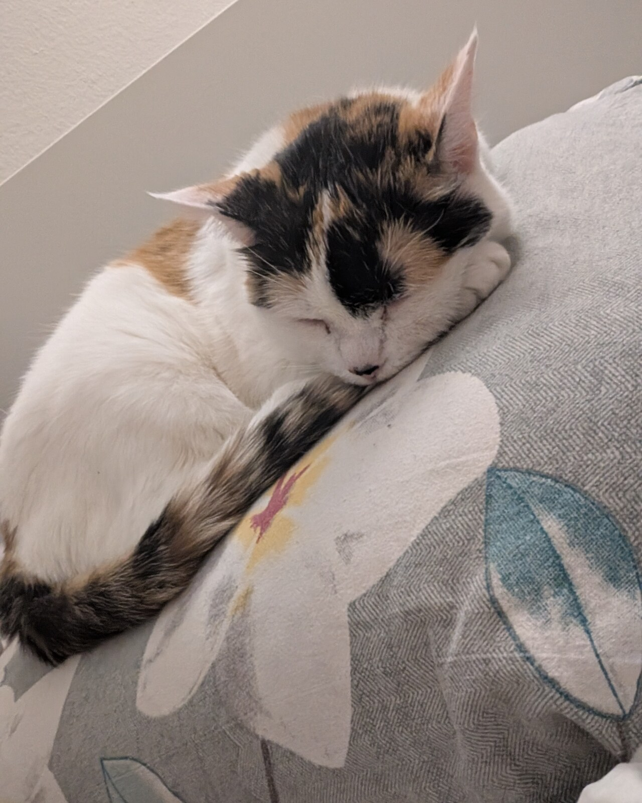

People ask how I came to read stones that almost nobody else can read. The answer starts on an island in West Blue.

## The library in the tree

I grew up on Ohara. Its scholars worked in a library inside the Tree of Knowledge, a tree about 5,000 years old. For a child who loved books, there was no better place on any sea.

The library's director, Professor Clover, was a friend of my mother. He let me read there long before I was old enough to understand everything I read. I did not mind. I read it anyway, and came back the next day.

## Learning the stones

The Poneglyphs are huge stone blocks, carved in an ancient script and, as far as anyone knows, impossible to destroy. I learned to read that script as a child. At eight I passed the archaeology exam and became a scholar of Ohara.

My mother, Nico Olvia, was an archaeologist too. She left on an expedition to find Poneglyphs when I was two, and I grew up waiting for her to come home.

## The year the island burned

Some of the history in the Poneglyphs comes from the Void Century, a hundred years the World Government does not allow anyone to study. Ohara's scholars studied it anyway.

When I was eight, the Government answered with a Buster Call. The library burned with the tree. My mother came back that day, and stayed with the scholars to the end. I was the only one from Ohara who survived.

## Twenty years of running

A giant called Jaguar D. Saul, once a vice admiral of the Marines, protected me on the island. Because of him, I got away.

I had a bounty from the age of eight: 79,000,000 berries, for a child who could read. For about twenty years I ran. I learned to trust nobody for long.

## Miss All Sunday

For a time I worked for Baroque Works, under the codename Miss All Sunday. I was its vice president, and partner to its leader, Crocodile.

I am not proud of all of it. But it brought me to Arabasta, and to the crew I sail with now.

## A crew that said yes

After Arabasta I asked the Straw Hat Pirates to let me join. Their captain said yes, as if it were simple.

## What Ohara taught me

The scholars of Ohara studied the history the world was told to forget, and they lost everything for it. I still think history belongs to everyone.

So I keep reading:

- the Poneglyphs, wherever the crew lands
- the ruins and records of every island
- any book I can find
- the Void Century, one stone at a time

Everything else is patience.

---

Who took the photos, and their licence, is on the [credits page](/credits/#photos), with everyone who helped make this site.
